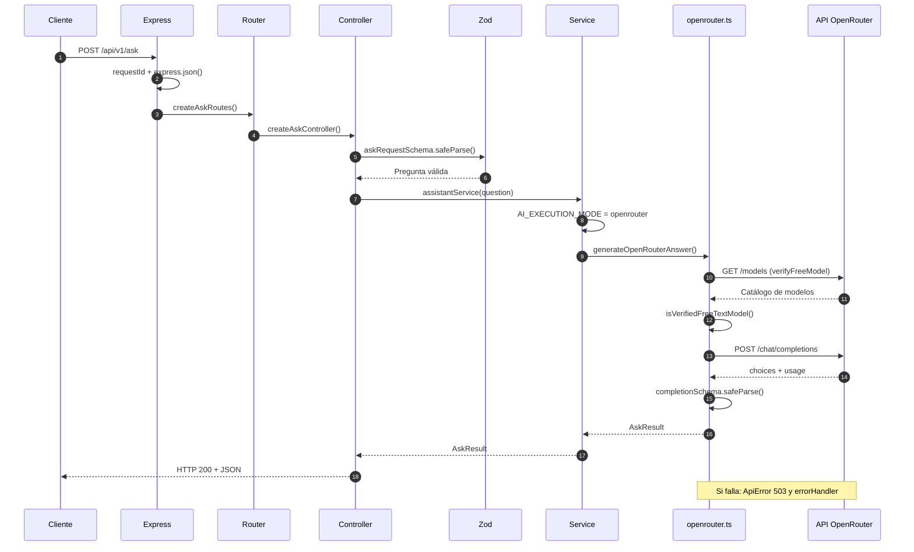

## Flujo de la petición (modo OpenRouter)

```mermaid
sequenceDiagram
  autonumber
  participant C as Cliente
  participant E as Express
  participant R as Router
  participant K as Controller
  participant Z as Zod
  participant S as Service
  participant O as openrouter.ts
  participant A as API OpenRouter
  C->>E: POST /api/v1/ask
  E->>E: requestId + express.json()
  E->>R: createAskRoutes()
  R->>K: createAskController()
  K->>Z: askRequestSchema.safeParse()
  Z-->>K: Pregunta válida
  K->>S: assistantService(question)
  S->>S: AI_EXECUTION_MODE = openrouter
  S->>O: generateOpenRouterAnswer()
  O->>A: GET /models (verifyFreeModel)
  A-->>O: Catálogo de modelos
  O->>O: isVerifiedFreeTextModel()
  O->>A: POST /chat/completions
  A-->>O: choices + usage
  O->>O: completionSchema.safeParse()
  O-->>S: AskResult
  S-->>K: AskResult
  K-->>C: HTTP 200 + JSON
  Note over O,A: Si falla: ApiError 503 y errorHandler
```
